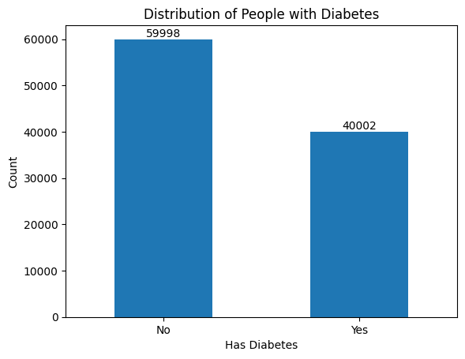
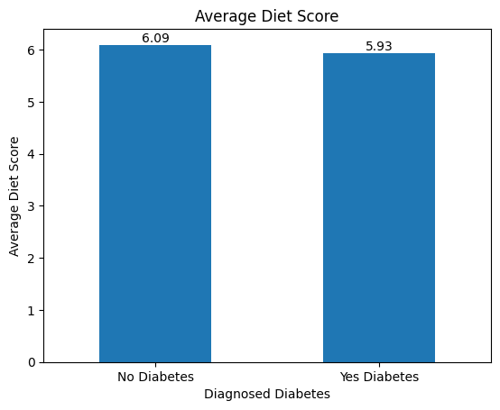
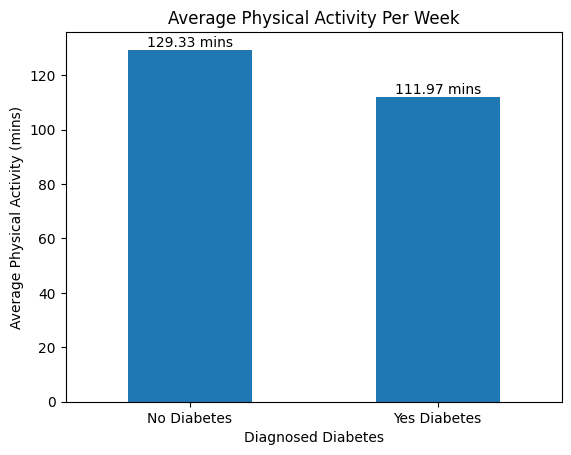
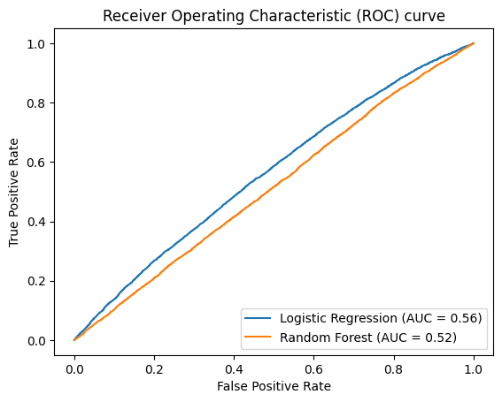
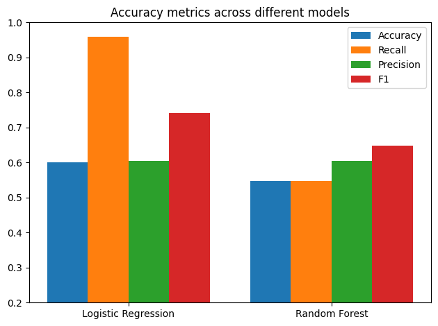

## Diabetes Prediction Model Analysis

**Project description:** This project looks at whether everyday lifestyle choices like how healthy you eat or how much you exercise can help predict if someone has diabetes. Using real data and a few machine learning models, the goal is to see how much lifestyle alone can tell us about diabetes risk.

### Data Loading and Cleaning

First we load the data

```python
df = pd.read_csv("diabetes_dataset.csv")
```

Check for null values

```python
df.isnull().sum()
```

Check what type of data we are dealing with in a table format,
display the first five rows

```python
df.head(5)
```

### Exploratory Data Analysis (EDA)

Here we explore the distribution of key variables such as age, gender, diabetes diagnosis, smoking status, and alcohol consumption.
Bar charts and summary statistics help highlight trends in the population. For example, the diabetes diagnosis distribution reveals whether the dataset is balanced or imbalanced.



Additionally, we compare average diet score and average physical activity levels between individuals with and without diabetes.




These insights help determine whether lifestyle factors differ meaningfully between the two groups before applying machine learning models.

### Feature Selection

For this analysis, two lifestyle-related predictors were selected:

- **diet_score**
- **physical_activity_minutes_per_week**

These features were chosen because they directly support the research question: _Do lifestyle behaviors help predict diabetes diagnosis?_

The target variable, `diagnosed_diabetes`, is binary (0 = No diabetes, 1 = Diabetes).

```python
X = df[['diet_score', 'physical_activity_minutes_per_week']]
y = df['diagnosed_diabetes']
```

### Logistic Regression and Random Forest Comparison

ROC curves visualize the trade-off between true positive rate and false positive rate.

- Logistic Regression AUC: **~0.56**
- Random Forest AUC: **~0.52**

An AUC of 0.50 represents random guessing, so both models perform only slightly better than chance. This confirms that using only diet score and physical activity minutes per week is not sufficient for reliable diabetes prediction.



### Accuracy Metrics between the Models



### Conclusion

Both models showed that lifestyle variables alone have limited predictive power for diabetes. While healthier diet and higher physical activity are linked to lower risk, they are not strong enough on their own to classify diabetes accurately.

Logistic Regression identified most positive cases but with many false alarms, while Random Forest was slightly more balanced but still not highly accurate. With AUC values close to 0.50, both models performed only slightly better than random guessing.

In short, lifestyle behaviors help explain diabetes trends but are insufficient for reliable prediction without additional clinical features.

For more details see <a href="https://github.com/apurewal19/diabetes-prediction-model-analysis/blob/main/diabetes_health_indicators.ipynb">Project Files</a>
