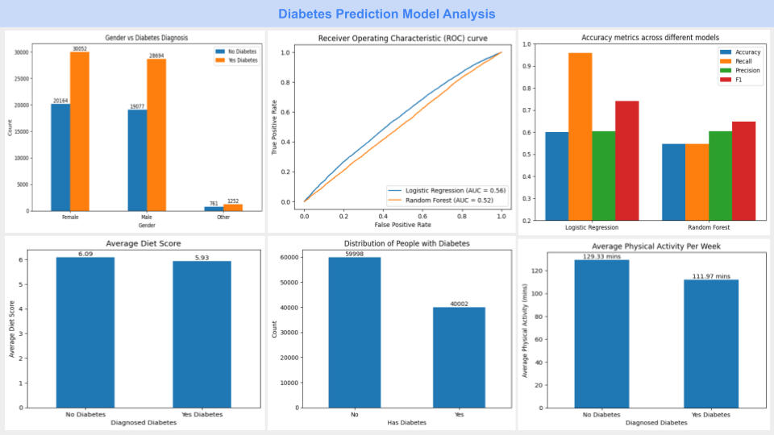
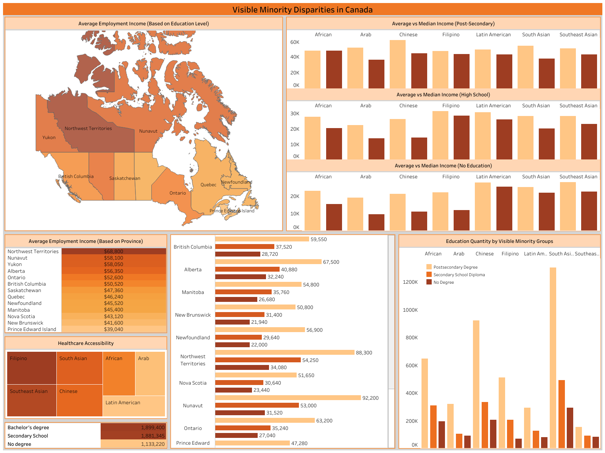

## Portfolio

Welcome to my portfolio! I come from a background in Data Analytics and have extensive skills in tools such as Python, SQL, Tableau and Excel.
I have a strong passion for exploratory data analysis (EDA) and love coming up actionable insights to help support data-driven solutions.
Based off of the data I find I can also develop dashboards to help present my findings for business needs.

Please feel free to explore my portfolio and reach out if I seem like a desired fit.

---

[Diabetes Prediction Model Analysis](/diabetes.md)

---

[Restaurant Output Analysis](/rest_output_analysis.md)

---

[MLB Payroll Analysis Dashboard](https://public.tableau.com/views/MLBPayrollAnalysis_17384470881290/MLBPayrollAnalysis?:language=en-US&:sid=&:redirect=auth&:display_count=n&:origin=viz_share_link)

---

[Visible Minority Comparison Dashboard](https://public.tableau.com/shared/DW559RMHD?:display_count=n&:origin=viz_share_link)

---
