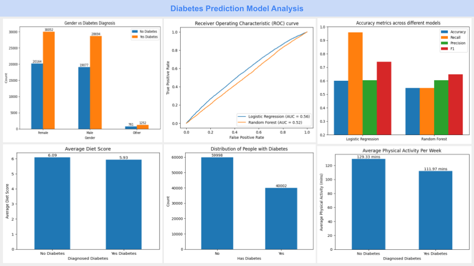
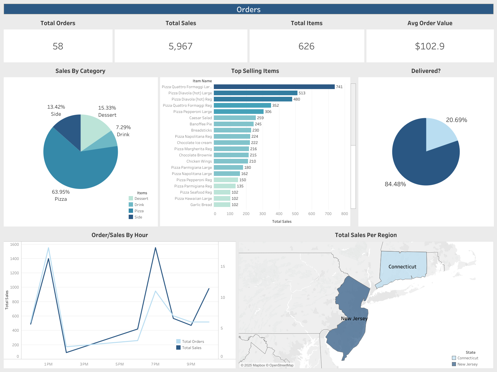
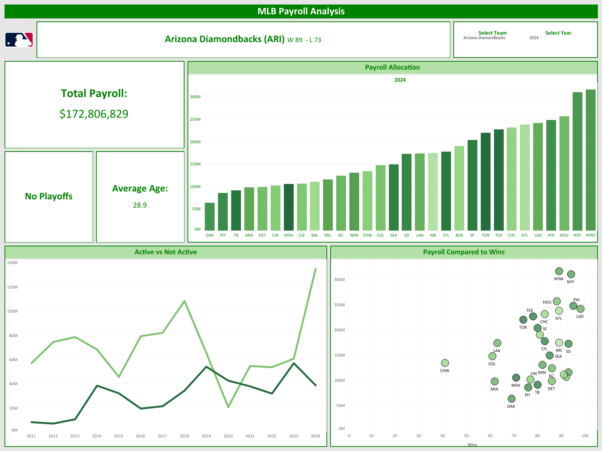
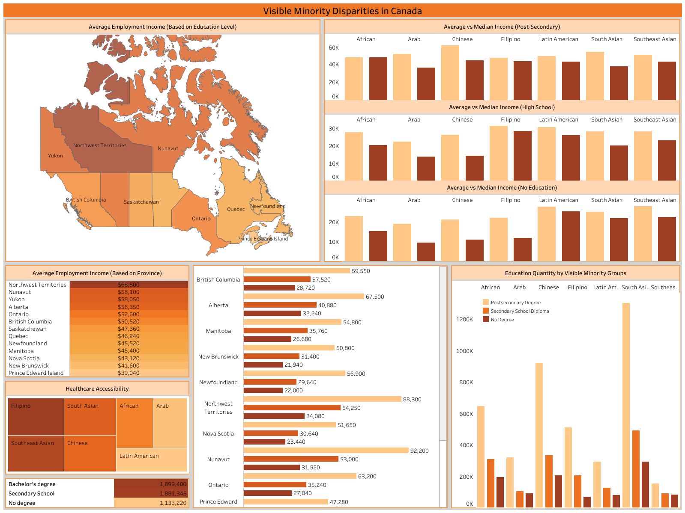

## Portfolio

Welcome to my portfolio! I'm a Data Analytics professional skilled in Python, SQL, Tableau, Power BI, and Excel, with a passion for exploratory data analysis and turning raw data into actionable business insights.
I enjoy the full analytics workflow — from cleaning and querying data, to uncovering trends through EDA, to building dashboards that make findings clear and usable for business decision-making.

Please feel free to explore my portfolio and reach out if I seem like a desired fit.

---

**Project Link:** [Diabetes Prediction Model Analysis](/diabetes.md)

Tools Used: Python (pandas, numpy, scikit-learn, matplotlib)

---

**Project Link:** [Restaurant Output Analysis](/rest_output_analysis.md)

Tools Used: SQL, Excel, Tableau, Data Flow Diagrams

---

**Project Link:** [MLB Payroll Analysis Dashboard](https://public.tableau.com/views/MLBPayrollAnalysis_17384470881290/MLBPayrollAnalysis?:language=en-US&:sid=&:redirect=auth&:display_count=n&:origin=viz_share_link)

Tools Used: Tableau, Excel

---

**Project Link:** [Visible Minority Comparison Dashboard](https://public.tableau.com/shared/DW559RMHD?:display_count=n&:origin=viz_share_link)

Tools Used: Tableau, Excel

---
