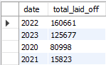
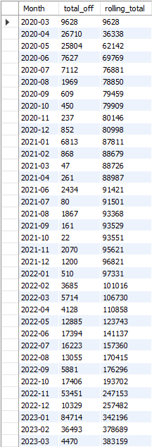
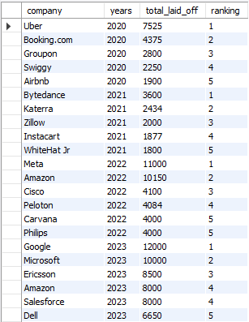
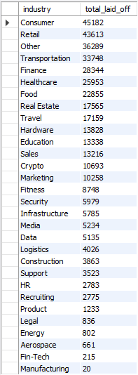

# SQL Layoffs Data Analysis

Exploratory data analysis of global tech layoffs (March 2020 – March 2023), built entirely in MySQL. The project covers full data cleaning of a messy real-world dataset followed by an EDA layer using CTEs and window functions to surface trends by company, industry, country, and time.

## Dataset

- **Size:** ~2,360 raw records, 9 columns (`company`, `location`, `industry`, `total_laid_off`, `percentage_laid_off`, `date`, `stage`, `country`, `funds_raised_millions`)
- **Timeframe:** March 2020 – March 2023

## Tools Used

- MySQL (MySQL Workbench)
- SQL features: CTEs, window functions (`ROW_NUMBER()`, `DENSE_RANK()`), `JOIN`-based self-updates, aggregate functions, date functions

## Project Structure

```
├── README.md
├── data/
│   └── layoffs.csv                        # Raw dataset
├── sql/
│   ├── data_cleaning_layoffs.sql          # Data cleaning script
│   └── exploratory_data_analysis_layoffs.sql  # EDA script
└── images/
    ├── yearly_totals.png
    ├── rolling_total_over_time.png
    ├── top_5_companies_per_year.png
    └── industry_count_totals.png
```

## Data Cleaning Process

Steps performed in `data_cleaning_layoffs.sql`:

1. **Staged the raw data** into a working copy (`layoffs_staging`) to preserve the original table
2. **Removed duplicates** using `ROW_NUMBER()` partitioned across all columns to flag and delete exact duplicate rows
3. **Standardized text fields** — trimmed whitespace from `company`, consolidated inconsistent `industry` labels (e.g., `Crypto`, `Crypto Currency`, `CryptoCurrency` → `Crypto`), and stripped trailing periods from `country` (e.g., `United States.` → `United States`)
4. **Converted `date`** from text to a proper `DATE` type using `STR_TO_DATE()`
5. **Backfilled missing `industry` values** with a self-join, matching blank industries to the same company's industry from another row
6. **Removed rows with no signal** — deleted records missing both `total_laid_off` and `percentage_laid_off`, since neither key metric could be recovered

Post-cleaning dataset: **1,995 usable records**.

## Key Questions Explored

`exploratory_data_analysis_layoffs.sql` answers:

- What's the largest single layoff event, and which companies laid off 100% of staff?
- How do total layoffs trend by year and by month?
- What does the cumulative (rolling) layoff total look like over time?
- Which companies laid off the most people in a given year?
- Which industries and countries were hit hardest overall?

## Findings

- **2022 was the worst full year** for layoffs (160,661 people), with 2023 already at 125,677 by early March — on pace to exceed 2022 if the trend held

  
  *Total layoffs by year*

- **January 2023 was the single worst month** in the dataset, at 84,714 layoffs — driven largely by big tech (Google, Microsoft, Amazon all had major cuts announced that month). The rolling total below shows how sharply layoffs accelerated starting in late 2022

  
  *Monthly layoffs and cumulative (rolling) total, 2020–2023*

- **Amazon, Google, and Meta** were among the top companies by total layoffs each year they appeared, alongside Uber (2020) and Bytedance (2021)

  
  *Top 5 companies by total layoffs, ranked within each year*

- **Consumer, Retail, and "Other"** were the hardest-hit industries overall, followed closely by Transportation and Finance

  
  *Total layoffs by industry*

- Several companies — including **Katerra (2,434 laid off)** and **Butler Hospitality (1,000 laid off)** — had a `percentage_laid_off` of 1, meaning they shut down entirely

## Skills Demonstrated

- Writing multi-step data cleaning pipelines in raw SQL
- Using window functions for deduplication (`ROW_NUMBER()`) and ranking (`DENSE_RANK()`)
- Structuring analysis with CTEs for readability
- Building a rolling/cumulative total with `SUM() OVER (ORDER BY ...)`
- Handling messy real-world data: inconsistent categories, malformed dates, missing values